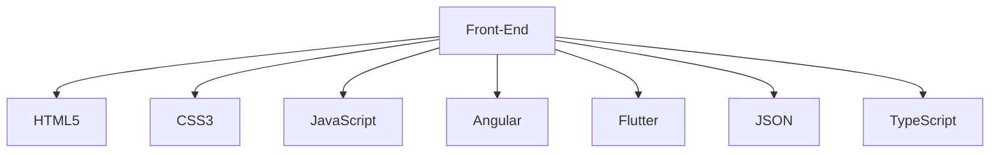
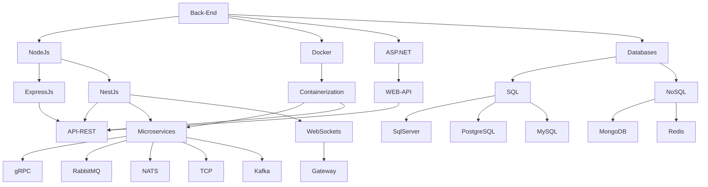

<!----------------------------------------------------------------------------------------------------------------------------------------------------------------->

<!----------------------------------------------------------------------------------------------------------------------------------------------------------------->

  
   
  
  

 

<!----------------------------------------------------------------------------------------------------------------------------------------------------------------->

 

<!----------------------------------------------------------------------------------------------------------------------------------------------------------------->

 
<a href="https://www.instagram.com/lara_harry16/" target="_blank"> 

<!----------------------------------------------------------------------------------------------------------------------------------------------------------------->

<!----------------------------------------------------------------------------------------------------------------------------------------------------------------->

<!----------------------------------------------------------------------------------------------------------------------------------------------------------------->

 
   
   
    
    
  
   
    
  
  
   
   
   
   
   
   

   
   
   

<!----------------------------------------------------------------------------------------------------------------------------------------------------------------->

 
<b>Visitors Count 👽 </b>
  

 
 

<!----------------------------------------------------------------------------------------------------------------------------------------------------------------->

<!----------------------------------------------------------------------------------------------------------------------------------------------------------------->

